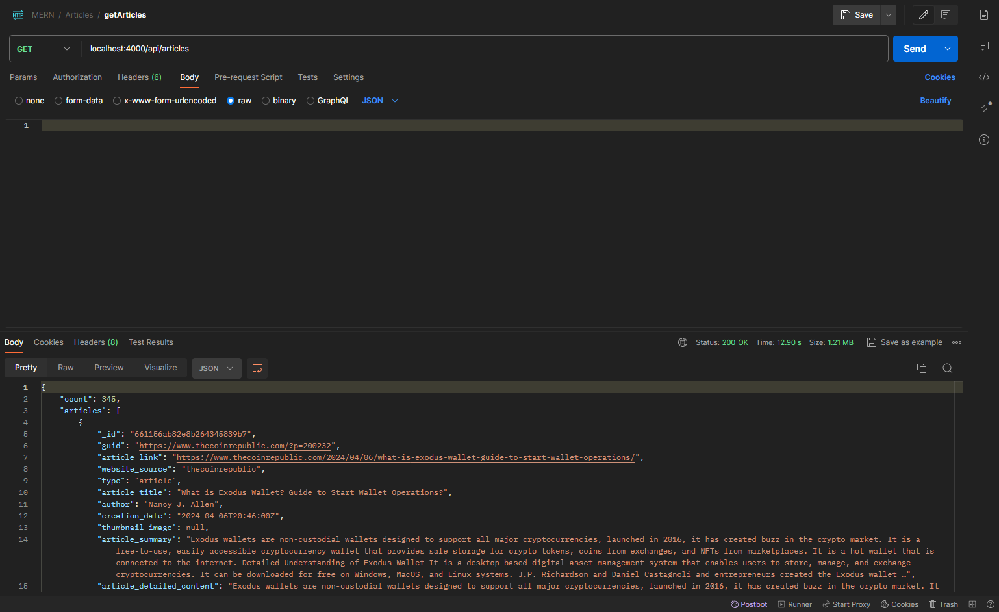
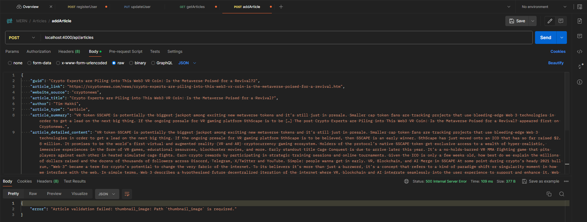

# Articles APIs
>[!IMPORTANT]
> Use this with caution!!!

## Get all articles from MongoDB
Send a GET request with endpoint `localhost:4000/api/articles`
  

## Add an article
>[!IMPORTANT]
> I haven't add middleware to check if the user is logged in or not

Send a POST request with endpoint `localhost:4000/api/articles` and a json body contains the following:
- `guid`
- `article_link`
- `website_source`
- `article_title`
- `author`
- `article_type`
- `article_summary`
- `article_detailed_content`
- `creation_date`
- `thumnail_image`

Any missing fields will result in an error with an status code [500](https://developer.mozilla.org/en-US/docs/Web/HTTP/Status/500).
 For example: missing `thumbnail_image`

## Delete an article
>[!IMPORTANT]
> I haven't add middleware to check if the user is logged in or not

## Update an article
>[!IMPORTANT]
> I haven't add middleware to check if the user is logged in or not

## Perform full-text search

## Autocomplete
>[!WARNING]
> I haven't add an autocomplete search index so for the time-being, don't use this yet...