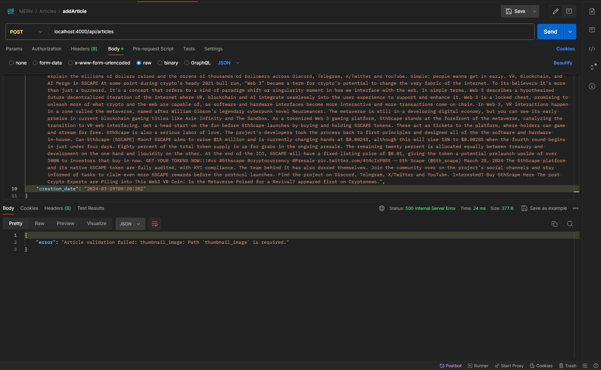
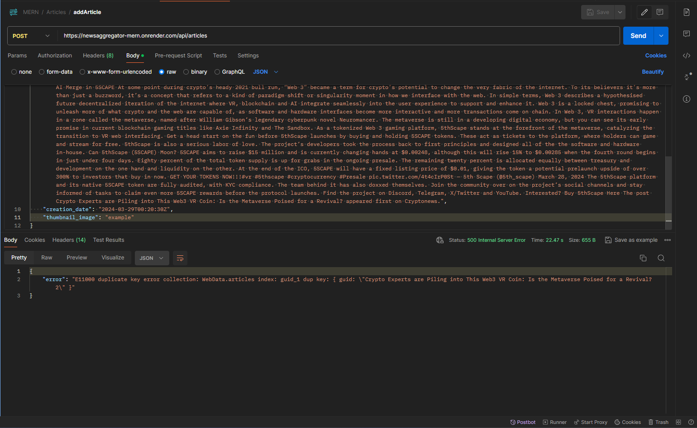
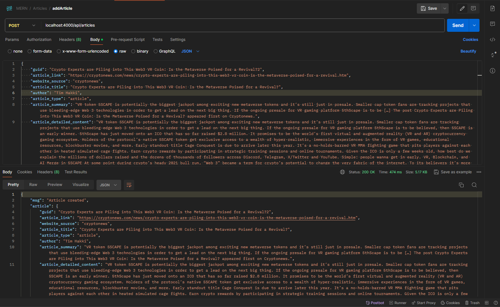
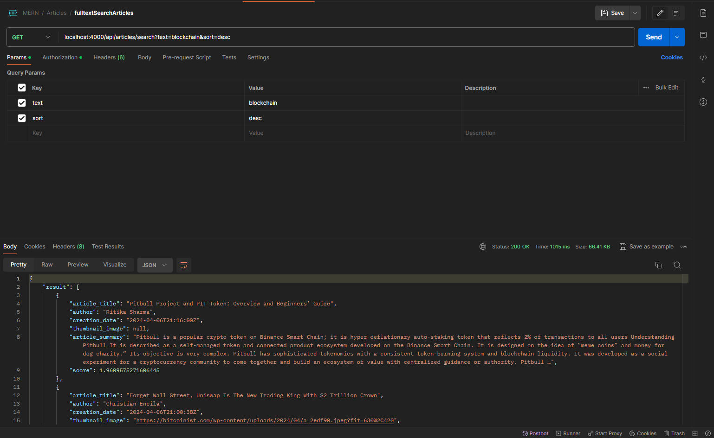

# Articles APIs
>[!IMPORTANT]
> Use this with caution!!!.

## Get all articles from MongoDB
Send a GET request with endpoint `localhost:4000/api/articles`
  
If it is implemented correctly, it should have the following result with status code 200:

On the other hand, if it fails, it should return status code 500 with an error message...

## Add an article
>[!IMPORTANT]
> I haven't add middleware to check if the user is logged in or not.

Send a <b>POST</b> request with endpoint `localhost:4000/api/articles` and a json body contains the following:
- `guid`: String,
- `article_link`: String,
- `website_source`: String,
- `article_title`: String,
- `author`: String,
- `article_type`: String,
- `article_summary`: String,
- `article_detailed_content`: String,
- `creation_date`: String (will be better if I can format date here when user adds a new post),
- `thumnail_image`: String

Any missing fields will result in an error with an status code 400 with error message. 
 For example: missing `thumbnail_image`

If you try to add a post that have the same content (guid, title, summary and etc) it will result in an duplication error with status code 500.

If it is implemented correctly, it should have the following result with status code 200:

## Delete an article
>[!IMPORTANT]
> I haven't add middleware to check if the user is logged in or not

Send a <b>DELETE</b> request with endpoint `localhost:4000/api/articles/<id>` and a json body containing the article's id
(The id can be seen when connecting MongDB via web).

If it is implemented correctly, it should return status code 200 and notify success.

## Update an article
>[!IMPORTANT]
> I haven't add middleware to check if the user is logged in or not

Send a <b>PUT</b> request with endpoint `localhost:4000/api/articles/<id>` and a json body contains the following:
- `id`: String (The id can be seen when connecting MongDB via web),
- `guid`: String,
- `article_link`: String,
- `website_source`: String,
- `article_title`: String,
- `author`: String,
- `article_type`: String,
- `article_summary`: String,
- `article_detailed_content`: String,
- `creation_date`: String (will be better if I can format date here when user adds a new post),
- `thumnail_image`: String

Any missing fields will result in an error with an status code 400 with error message.
(Ah yes, all fields, isn't it annoying!) 

## Perform full-text search

Send a <b>GET</b> request with endpoint `localhost:4000/api/articles/search?text=<query>&sort=<sortOrder>`

For example: If you want to search for `blockchain` and the sort order to the latest post first or `desc` you send a request to `localhost:4000/api/articles/search?text=blockchain&sort=desc`

If its is implemented correctly, it should return status code 200 with the article(s) that contain the mentioned text:

## Autocomplete
>[!WARNING]
> I haven't add an autocomplete search index so for the time-being, don't use this yet...